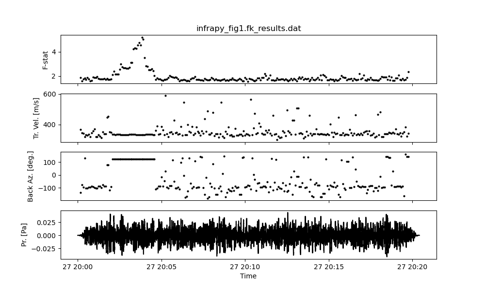
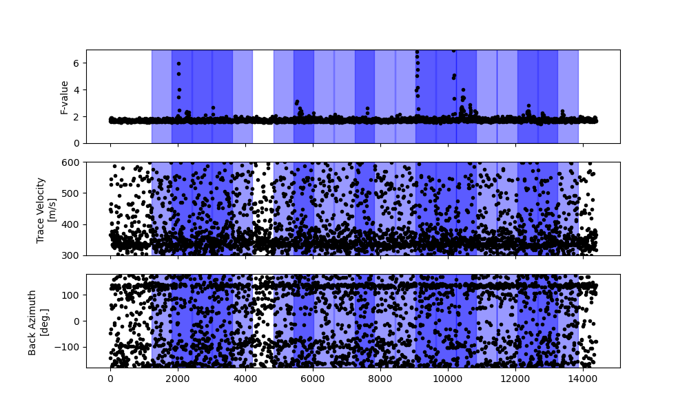
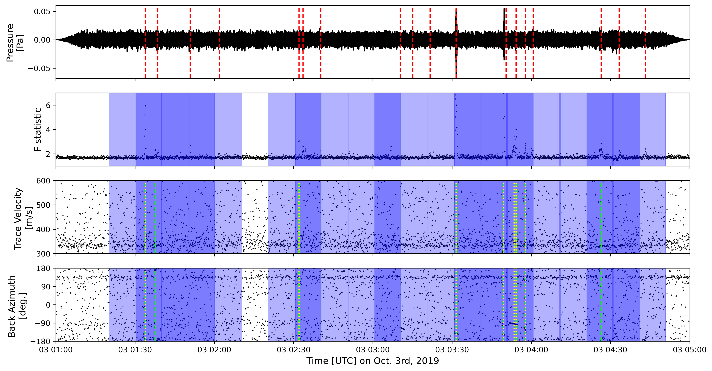

.. _quickstart:

==========
Quickstart
==========

As an introduction to the package, we will reproduce results from the Bishop et al. 2022 manuscript.
The steps below assume you are in the :code:`riddl/examples` directory.

-------------------------------------------
Preparing the data - InfraPy beamforming
-------------------------------------------
Infrasound array data is first beamformed to produce a set of processing results, such as the F-statistic, the back azimuth, and the trace velocity.
The `InfraPy <https://github.com/LANL-Seismoacoustics/infrapy>`_ infrasound signal analysis can be used for beamforming, and we encourage users to see that documentation for further details.

For example, we can recreate Figure 1 in Bishop et al. 2022 using the InfraPy command line interface. Using the supplied config file :code:`infrapy_fig1_example.cfg` located in the :code:`examples` directory,
run the command
    .. code-block:: bash

        infrapy run_fk --config-file infrapy_fig1_example.cfg

The resulting :code:`infrapy_example.fk_results.dat` file can be viewed with the command
    .. code-block:: bash

        infrapy plot fk --config-file infrapy_fig1_example.cfg --starttime 2019-09-27T20:00:00.00 --endtime 2019-09-27T20:20:00.00

Note that parallel processing can be used by adding the line :code:`cpu_cnt = N`, where :code:`N` is your number of CPU cores, to the .cfg files under the :code:`[FK]` header.

---------------------------
Creating training data
---------------------------

Once beamforming :code:`.dat` files have been created, they need to be futher processed to be used as training data for the machine learning models. 
An example script, :code:`pre_process.py`, is provided that does the following, required, processing.

1. Remove the header information and convert the raw InfraPy output :code:`.dat` files to :code:`.npy` files.

2. The training label needs to be added to the file name, e.g., "transient".

3. The machine learning architecture can only accept arrays that are 241 x 3. The last **three** columns and the first **241** points in the array will be used for ML processing.

This section will eventually be replaced by a more extensive GUI for analyst labelling. For now, we assume that we know that the first window contains a transient, and the next two windows are labelled as "noise."
The provided array data in the :code:`/examples/data/Bishop_etal2022` directory is compressed; before running the script, be sure to extract the data with :code:`tar -zxvf FILE_NAME` or similar.

A simple workflow for the that uses this script is below:

First we beamform the data:
    .. code-block:: bash

        conda activate infrapy_env
        infrapy run_fk --config-file infrapy_fig1_example_long.cfg

Then we can run the :code:`pre_process.py` file to generate the :code:`.npy` files. We 
    .. code-block:: bash

        conda activate riddl_env
        python pre_process.py

The output of this file will be three labelled :code:`.npy` files in the :code:`fk_array_data` directory: :code:`infrapy_example_long.0.transient.npy`, :code:`infrapy_example_long.1.noise.npy`, and :code:`infrapy_example_long.2.noise.npy`.
Note that the labels "transient", "noise", and "noise" are included in the file names.

The training data (:code:`.npy` files) for the original Bishop et al. 2022 manuscript has been provided in the :code:`/examples/data/Bishop_etal2022` directory.

---------------------------
Building tensors
---------------------------
Once a collection of :code:`.npy` files has been curated, they can be used to generate tensors for use with `TensorFlow2`.
An example file :code:`build_tensors.py` is provided in the :code:`examples` directory.

.. code-block:: bash

    python build_tensors.py

This function pulls files from the :code:`Transient`, :code:`Noise`, :code:`Moving`, and :code:`Persistent` directories in the :code:`Bishop_etal2022` and uses 75\% of the data for training.
The :code:`Transient` and :code:`Moving` examples are merged, and the resulting classes are balanced to 857 examples each. The resulting tensors are written to
:code:`soi_example_` testing and training tensors.

Using the CLI, we can build tensors from .npy files in the same way as:

    .. code-block:: bash

        riddl models fk build --data-dir ./data/Bishop_etal2022 --output-id soi_test --output-dir ./models --labels-file labels_file.txt --merge-labels-file merge_labels_file.txt

We found that configuration based on text files works well to manage the categorical data: (1) the labels, (2) which labels to merge, if any; and (3) file patterns to filter the input array-processed data - such as station names.

#. :code:`labels_file.txt`: A list of the labels for the ML model, with each label on a separate line.

#. :code:`merge_labels_file.txt`: An optional list of the labels to merge when training the ML model, with each label on a separate line.

#. :code:`file_pattern.txt`: An optional list of file patterns to add flexibility in which sets of data are used for training. Each unique file pattern, e.g., :code:`I56` (no wildcard characters required), should appear on a separate line. We will use this capability in the transportability analysis below.

---------------------------
Training the model
---------------------------
To train a model using pre-split training and testing data use the :code:`train` command (be aware that training can be time intensive, requiring multiple minutes per fold):

    .. code-block:: bash

      riddl models fk train  --data-id ./models/train/soi/soi --num_folds 1

The :code:`--data-id` flag is used to specify the file pattern (with relative directory) where training (:code:`_train*`) and testing (:code:`_test*`) tensors can be found.

To use a k-fold split to save the best performing model, set the number of folds > 1.

    .. code-block:: bash

      riddl models fk train  --data-id ./models/train/soi/soi --num_folds 5

In these examples, the training and test data used in the manuscript are in the :code:`/models/train` folder. The pre-trained models from the manuscript are in the :code:`/models/use` folder.

The provided data splits and pre-trained models are:

* full: "transient", "persistent", "moving source", and "noise" categories are separated for a four category classifier.

* soi: "transient", "persistent", and "moving source" categories are merged against the "noise" category for a binary classifier.

* soi2: "transient" and "moving source" categories are merged against separate "persistent" and "noise" categories for a ternary classifier.

---------------------------
Running the detector
---------------------------

Once raw infrasound data from an array has been beamformed, we can run the ML detector.
For example, we can recreate Figure 5 of Bishop et al. 2022. The SAC files and InfraPy configuration file are provided in "examples/data/Bishop_etal2022/Fig5".

An example script that runs the detector, :code:`run_detector.py`, is provided in the :code:`examples` directory.
    
    .. code-block:: bash

        conda activate riddl_env
        python run_detector.py

We can also run this example from the command line interface. Note that the InfraPy configuration file (:code:`infrapy_fig5_example.cfg`) is provided.
    
    .. code-block:: bash

        conda activate riddl_env
        riddl models fk detect --model-id ./models/use/soi2 --fk-file ./data/Bishop_etal2022/Fig5/fig5.fk_results.dat

Plotted with the analyst picks (:code:`analyst_review.txt`) and adaptive F detector results (:code:`fig5.p01.dets.json` and :code:`fig5.p05.dets.json`), we have:

This script was created with the :code:`plot_fig5.py` file, which can be run from the :code:`infrapy_env` conda environment. The red dashed lines in the top row show the manual analyst picks. The green and yellow dashed lines in
the bottom two rows show the adaptive F-detector detections with values of 0.05 (green) and 0.01 (yellow). The blue regions in the figure denote where the machine learning model
:code:`soi2` declared a transient detection. 

In the intervening time between the publication of the original manuscript and the creation of this manual, some of the original source files for Figure 5 were lost.
While this figure is not an exact replica of the Figure 5 in the Bishop et al. (2022) manuscript, it is representative of the ML detector performance. Development of
this approach is ongoing.

---------------------------
Transportability analysis
---------------------------
As a synthesis of the steps above, we can run a transportabilty analysis on our ML model. We will train a model using the provided "I56" and "I53" data and then use that model to evaluate data from "I57".

First, we need to construct two sets of tensors: (a) one set for training from the provided  "I56" and "I53" data, and (b) one set of tensors for evaluating the trained model to all the "I57" data.
We'll do this with two separate command line calls:

    .. code-block:: bash

      conda activate riddl_env
      riddl models fk build --data-dir ./data/Bishop_etal2022 --output-id transportability_test --output-dir . --labels-file labels_file.txt --merge-labels-file merge_labels_file.txt --file_pattern pattern_file.txt
      riddl models fk build --data-dir ./data/Bishop_etal2022 --output-id I57 --output-dir . --labels-file labels_file.txt --test-fraction 0.0 --merge-labels-file merge_labels_file.txt --file_pattern pattern_file2.txt

Then we train the model on the "I56" and "I53" data.

    .. code-block:: bash

      riddl models fk train  --data-id ./transportability_test --num_folds 1 --model_out I57_transportability

Finally, we point the trained model at the "I57" data:

    .. code-block:: bash

      riddl models fk evaluate --model-id ./I57_transportability --data-id I57

